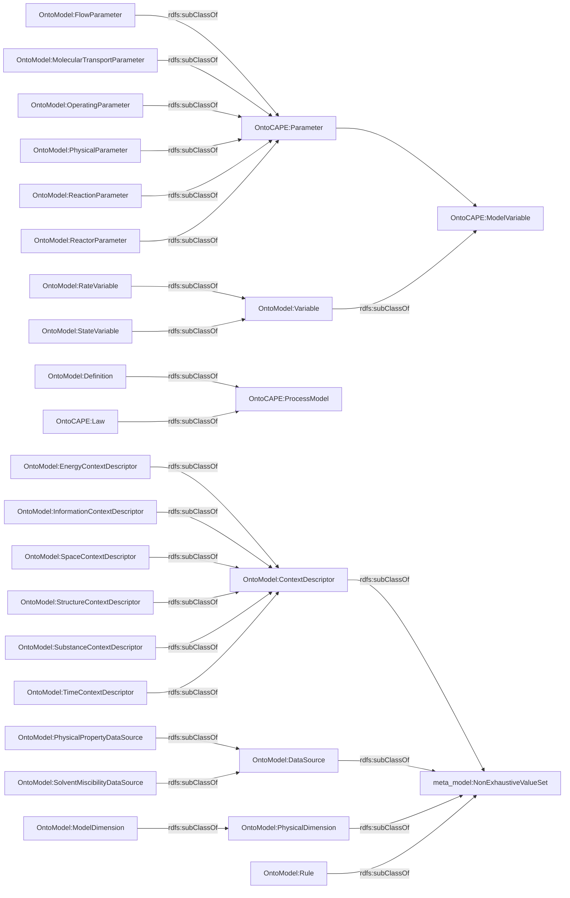

```mermaid
flowchart LR
    OntoCAPE:Parameter --> OntoCAPE:ModelVariable;
    OntoModel:FlowParameter -- rdfs:subClassOf --> OntoCAPE:Parameter;
    OntoModel:MolecularTransportParameter -- rdfs:subClassOf --> OntoCAPE:Parameter;
    OntoModel:OperatingParameter -- rdfs:subClassOf --> OntoCAPE:Parameter;
    OntoModel:PhysicalParameter -- rdfs:subClassOf --> OntoCAPE:Parameter;
    OntoModel:ReactionParameter -- rdfs:subClassOf --> OntoCAPE:Parameter;
    OntoModel:ReactorParameter -- rdfs:subClassOf --> OntoCAPE:Parameter;
    OntoModel:Variable -- rdfs:subClassOf --> OntoCAPE:ModelVariable;
    OntoModel:RateVariable -- rdfs:subClassOf --> OntoModel:Variable;
    OntoModel:StateVariable -- rdfs:subClassOf --> OntoModel:Variable;
    OntoModel:Definition -- rdfs:subClassOf --> OntoCAPE:ProcessModel;
    OntoCAPE:Law -- rdfs:subClassOf --> OntoCAPE:ProcessModel;
    OntoModel:ContextDescriptor -- rdfs:subClassOf --> meta_model:NonExhaustiveValueSet;
    OntoModel:EnergyContextDescriptor -- rdfs:subClassOf --> OntoModel:ContextDescriptor;
    OntoModel:InformationContextDescriptor -- rdfs:subClassOf --> OntoModel:ContextDescriptor;
    OntoModel:SpaceContextDescriptor -- rdfs:subClassOf --> OntoModel:ContextDescriptor;
    OntoModel:StructureContextDescriptor -- rdfs:subClassOf --> OntoModel:ContextDescriptor;
    OntoModel:SubstanceContextDescriptor -- rdfs:subClassOf --> OntoModel:ContextDescriptor;
    OntoModel:TimeContextDescriptor -- rdfs:subClassOf --> OntoModel:ContextDescriptor;
    OntoModel:DataSource -- rdfs:subClassOf --> meta_model:NonExhaustiveValueSet;
    OntoModel:PhysicalPropertyDataSource -- rdfs:subClassOf --> OntoModel:DataSource;
    OntoModel:SolventMiscibilityDataSource -- rdfs:subClassOf --> OntoModel:DataSource;
    OntoModel:PhysicalDimension -- rdfs:subClassOf --> meta_model:NonExhaustiveValueSet;
    OntoModel:ModelDimension -- rdfs:subClassOf --> OntoModel:PhysicalDimension;
    OntoModel:Rule -- rdfs:subClassOf --> meta_model:NonExhaustiveValueSet;
```