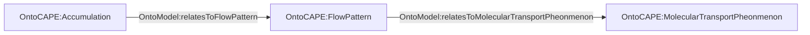
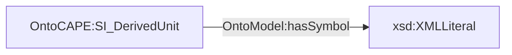
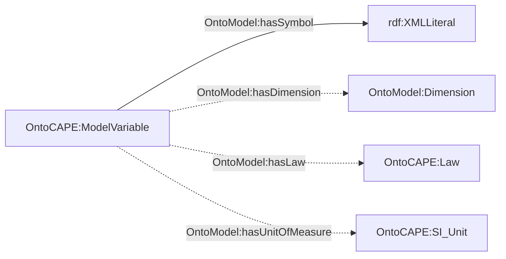
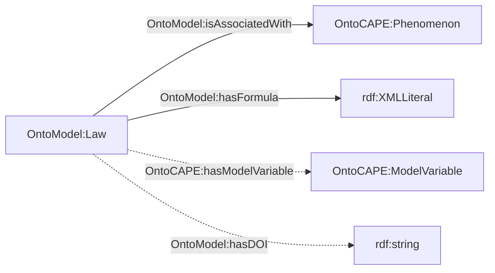

# Ontology Repository

A collection of useful ontologies.

Model ontology is developed based on OntoCAPE.

Define json file to add new knowledge to the model ontology:
- Example: use `python utils/patch_rdf.py --in_rdf OntoModel/OntoModel.owl --out_rdf OntoModel/OntoModel1.owl --json json/dispersion_coefficient_with_tubular_flow.json` to add axial dispersion law for short tube reactor
- json template
```json
{
  "Phenomenon": [
    {
      "name": "...",
      "class": "Accumulation or FlowPattern or MolecularTransportPhenomenon or ChemicalReactionPhenomenon",
      "flow_patterns": [],
      "molecular_transport_phenomena": []
    },
  ],
  "Unit": [
    {
      "name": "...",
      "class": "SI_BaseUnit or SI_DerivedUnit",
      "symbol": "<math>...</math>"
    },
  ],
  "Variable": [
    {
      "name": "...",
      "class": "RateVariable or StateVariable or ReactorParameter or FlowParameter or OperatingParameter or ReactionParameter or PhysicalParameter or MolecularTransportParameter",
      "symbol": "<math>...</math>",
      "unit": "...",
      "law": "...",
      "dimensions": ["Species and/or Reaction and/or Stream and/or Solvent"]
    },
  ],
  "Law": {
    "name": "(Target_Variable)_with_(Phenomenon)_by_(Authors)",
    "phenomenon": "...",
    "DOI": "...",
    "formula": "<math>...</math>",
    "variables": []
  }
}
```

See metagraphs for key classes below:
- Phenomenon

- Unit

- ModelVariable

- Law


